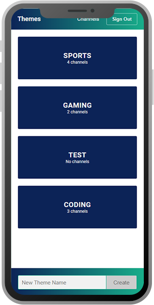

# YouTheme [Live Demo](https://youtheme.herokuapp.com/)

Youtube doesn't offer the possibility to filter your feed. With
a growing list of subscriptions, the experience becomes
inevitably messy.

YouTheme is a youtube subscriptions sorter, which allows you to
create custom feeds based on your own themes.

 

  

## 1. Built with:

- React
- Node (Express)
- GraphQL (Apollo Server & Apollo Client)
- MongoDB (Atlas & mongoose)
- styled-components

## 2. Usage (from root):

- `yarn client-install` - installs client dependencies
- `yarn dev` - starts app in development mode
- `yarn start` - starts node server
- `yarn server` - starts dev server with nodemon
- `yarn client` - starts client app
- `yarn heroku-postbuild` - script for heroku's deployment flow
